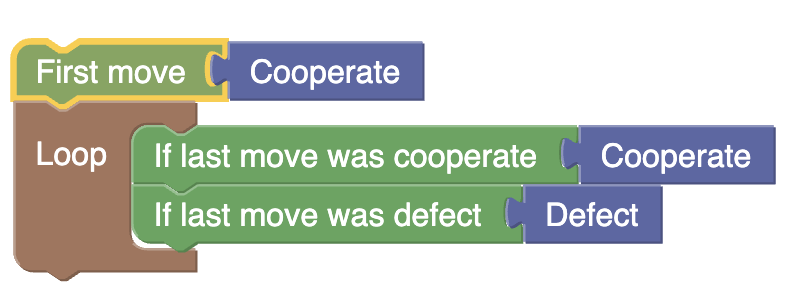

# BlocklyPrisonersDilemma

https://github.com/alexhkurz/BlocklyPrisonersDilemma

An example of how to tie a Blockly DSL to a backend that can be communicated with via HTTP requests.



The example provides a very rudimentary DSL for designing a strategy that plays the [iterated prisoner's dilemma](https://en.wikipedia.org/wiki/Prisoner's_dilemma#The_iterated_prisoner's_dilemma). There are currently only [2 players](https://github.com/alexhkurz/BlocklyPrisonersDilemma/blob/56446625474fa0e4931fe32e01046ee6ab9104ef/server/game_logic.js#L4) allowed. The implemented [payoff matrix](https://github.com/alexhkurz/BlocklyPrisonersDilemma/blob/main/server/game_logic.js#L6) is based on payoffs $3>2>1>0$. The game always runs for [`numberOfRounds`](https://github.com/alexhkurz/BlocklyPrisonersDilemma/blob/main/server/game_logic.js#L16) rounds.

**Some Limitations:**

- The DSL is quite minimal; many interesting strategies cannot be expressed.
- The number of rounds is fixed but should be probabilistic.
- The number of players is 2.
- Sometimes, only the second player gets the result of the game.
- There is no support for [tournaments](https://cs.stanford.edu/people/eroberts/courses/soco/projects/1998-99/game-theory/axelrod.html) or for keeping stats.
## Functionality

- *Register* (makes you known as Player 0 or Player 1 to the server).
- Design a strategy by dragging blocks from the toolbox to the workspace.
- *Send Blocks* to server. After Player 0  and Player 1 sent their strategy, the server plays them against each other. The result is sent back to (at least) one of the players.
- *Leave* allows another player to join.
- It is possible to *Save Blocks* and to *Load Blocks*.

## To see what it does

Go to http://35.91.83.141/ in two different browsers. 

You can design a strategy and play an iterated prisoner's dilemma against your opponent.

This has been tested only for [Tit-for-Tat](img/TitForTat.png) and only for two players.

## To install locally

Fork this repo.

Requires nodejs.

```
cd server
npm i
node server.js
```

Once you followed the steps above, you should be able to access http://localhost:3000/

## To deploy at AWS

This is just a rough run down.

Create an AWS instance (I selected all the default settings as of Oct 2023).

In a terminal on your machine log into your AWS instance:

```
ssh -i blocklyPrisonersDilemma.pem ec2-user@XXX.amazonaws.com
# Install and start apache
sudo yum update -y  
sudo yum install httpd -y  
sudo systemctl start httpd
sudo systemctl enable httpd
# Install node
https://docs.aws.amazon.com/sdk-for-javascript/v2/developer-guide/setting-up-node-on-ec2-instance.html
curl -o- https://raw.githubusercontent.com/nvm-sh/nvm/v0.39.5/install.sh | bash
. ~/.nvm/nvm.sh
nvm install --lts
npm install pm2 -g
```

To connect the apache server with the nodejs server we need a config file. Create `my.conf`

```
<VirtualHost *:80>
    ServerName 35.91.83.141
    ProxyRequests Off
    ProxyPreserveHost On
    <Location />
        ProxyPass http://localhost:3000/
        ProxyPassReverse http://localhost:3000/
    </Location>
</VirtualHost>
```


Copy files to AWS
```
scp -r -i blocklyPrisonersDilemma.pem my.conf ec2-user@XXX.amazonaws.com:/home/ec2-user
scp -r -i blocklyPrisonersDilemma.pem client ec2-user@XXX.amazonaws.com:/home/ec2-user
scp -r -i blocklyPrisonersDilemma.pem server ec2-user@XXX.amazonaws.com:/home/ec2-user
```

In your AWS instance run:
```
sudo mv my.conf /etc/httpd/conf.d/
cd server
npm install
pm2 start server.js
```
